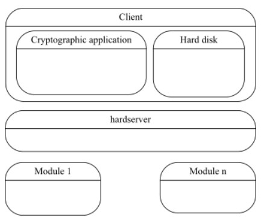
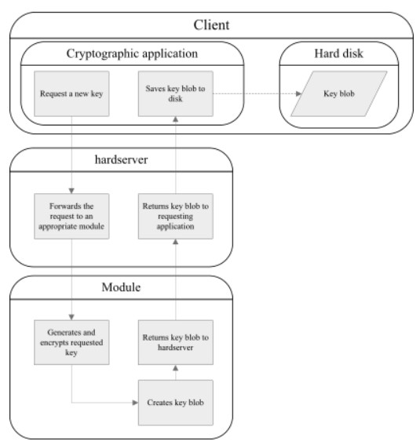
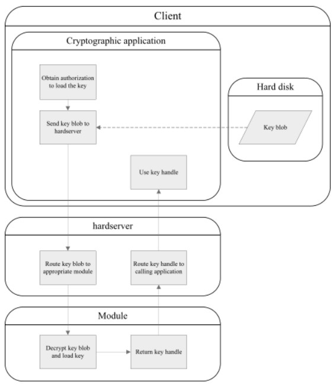
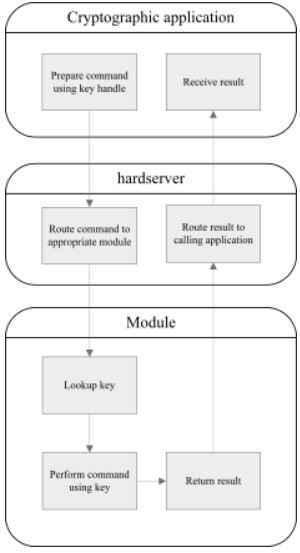

# nCore Architecture

### 1. Programming environment architecture

- Client
  - 어플리케이션이 실행되는 컴퓨터
- hardserver
  - 어플리케이션과 모듈 간의 중간 매개체
  - 어플리케이션 -(command)→ 모듈
  - 어플리케이션 ←(reply)- 모듈
  - nShield 모듈에서 실행됨
- Module
  - 암호화 작업을 수행하는 하드웨어

### 2. Generating a key

- key blob
  - 키 생성 시 하드디스크에 암호화된 형태로 저장
  - 모듈에 의해 암호화되고, 모듈에 의해 복호화 가능
    - 모듈에 암호화 키 저장
  - 키 정보와 엑세스 제어 목록(ACL)을 포함
    - ACL은 누가 그 키를 사용할 수 있고 그 키를 어떤 작업에 사용할 수 있는지를 정의
    

### 3. Loading a key

- 키에 대한 핸들이나 객체 참조가 어플리케이션으로 반환됨
  - M_KeyID
- 키를 사용하기 전 스마트카드/암호를 통한 인증이 필요
  - Security World 로드 시 인증함, 트랜잭션 시에는 인증하지 않음

### 4. Transacting a command

- 키 로드 후, 해당 키를 사용하여 모듈에게 암호화/복호화/서명 및 검증과 같은 암호 작업 수행 지시
