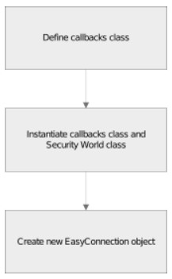
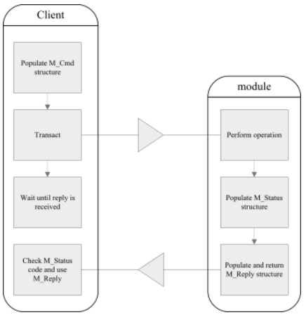
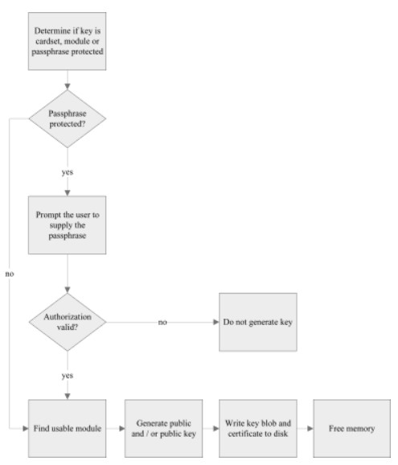

## 1. Overview
### 1-1. Connection

   
- 어플리케이션은 먼저 모듈에서 실행되고 있는 하드서버에 연결을 생성해야 한다

<br>

### 1-2. Transaction

   
- 하드서버 연결 후 어플리케이션은 모듈에 M_Command 전송
- 모듈은 M_Reply 응답
  - M_Reply는 status 및 명령의 결과를 포함

<br>

### 1-3. Creating a softcard

  ```bash
  ppmk --new --non-recoverable WorkedExampleSoftcard
  ```

<br>

### 1-4. Variables used in this tutorial

  | Variable type | Variable name | Variable description |
  | --- | --- | --- |
  | M_KeyID | kid | Public key ID |
  | EasyConnection | c | Connection to the hardserver |
  | WorldCallbacks | wcb | Callback object which defines how user interaction is handled |
  | SecurityWorld | world | Security World object |
  | String | appname | Application name |
  | String | ident | Key identity |
  | String | type | Key type |
  | int | size | Key size in bytes |
  | int | chanmech | Cryptographic mechanism used by the secure channel |
  | int | chanop | Secure channel ID |
  | M_IV | iv | Initialization vector |
  | Channel | ch | Secure channel object |
  | SoftCard | softcard | Softcard object |

<br>
<br>

## 2. Before connecting to the hardserver
### 2-1. Before connecting to the hard server
- WorldCallBacks, SecurityWorld 객체 인스턴스화

    ```java
    WorldCallbacks wcb = new WorldCallbacks();
    SecurityWorld world = new SecurityWorld(null, wcb, null, true);
    ```

<br>

### 2-2. WorldCallbacks
- 하드서버가 사용자로부터 키를 생성하거나 사용 권한을 얻을 때 상호작용하는 방법을 정의
- DefaultCallBack 클래스를 extends

    ```java
    class WorldCallbacks extends DefaultCallBack {
      
        public SoftCard configured_softcard = null;
      
        public String reqPPCallBack(String ReqPPAction) throws NFException {
          try {
            return Passphrase.readPassphrase("Enter softcard passphrase: ");
          } catch(IOException e) {
            throw new NFException(e.toString());
          }
        }
          
        // Callback to choose a softcard
        public SoftCard getSoftCardCallback() throws NFException {
          return configured_softcard;
        }
    }
    ```

<br>
<br>

## 3. Connecting to the hardserver
- Connecting to the hardserver
- 하드서버에 연결을 생성
- NFConnection 객체를 wrapping하는 EasyConnection 객체 인스턴스화

    ```java
    EasyConnection c = new EasyConnection(world.getConnection());
    ```

<br>
<br>

## 4. Generating a key
### 4-1. getKey()

  ```java
  Key k = world.getKey(appname, ident);
  ```

  - 키 생성 전, getKey() 메서드를 사용해 주어진 appname과 ident로 이미 존재하는 키가 있는지 확인
  - 키가 없는 경우 null을 반환

<br>

### 4-2. generate_key()

(1) 키 생성 프로세스

   

<br>

(2) generate_key() 메서드 구현  

a. SecurityWorld로부터 AppKeyGenerator 객체 획득
b. AppKeyGenerator 객체에서 key properties 지원 여부 확인  

  - property가 존재하지 않는 경우,
  
      ```java
      String[] properties = new String[] {
        "ident",
        "type",
        "size",
        "protect"
      }
      
      for (int i = 0; i < properties.length; i++) {
        if (akg.getProperty(properties[i]) == null) {
          System.out.println("Property " + properties[i] + " does not exist." +
            "Does your security world contain a usable softcard?");
          System.exit(0);
        }
      }
      ```

    - 모든 properties 존재하는 경우,

        ```java
        // setStringProperty() 및 setMenuProperty() 함수를 사용하여 
        // AppKeyGenProperty[]를 채움
        setStringProperty(akg, "ident", ident);
        setMenuProperty(akg, "type", type);
        setStringProperty(akg, "size", Integer.toString(len));
        
        // 키 보호 방법에 따라 protect 속성 결정
        switch(protection) {
            case NFKM_Key_flags.f_ProtectionModule:
              setMenuProperty(akg, "protect", "module");
              break;
        
            case NFKM_Key_flags.f_ProtectionPassPhrase:
        
              setMenuProperty(akg, "protect", "softcard");
              SoftCard cards[] = world.getSoftCards();
              wcb.configured_softcard = null;
        
              for(int n = 0; n < cards.length; ++n) {
                if(cards[n].getName().equals(prot_name)) {
                  wcb.configured_softcard = cards[n];
                }
                if(wcb.configured_softcard == null) {
                  throw new NoSuchSoftCard(prot_name);
                  break;
                }
              }
        }
        ```

<br>

(3) AppKeyGenerator 객체에 할당된 속성 값이 유효하다면 generate() 호출

  ```java
  InvalidPropValue badprops[] = akg.check(); // 속성 유효성 체크
    
  if (badprops.length > 0) {
    throw new BadKeyGenProperties(badprops);
  }
    
  return akg.generate(getUsableModule(world), null); // 새로 생성된 키에 대한 참조 반환
  ```

<br>

(4) cancel() 호출하여 메모리에 남아 있는 키 정보 destroy

  ```java
  akg.cancel();
  ```

<br>

### 4-3. Methods used in generate_key()

(1) getUsableModule()
- 사용 가능한 모듈 반환
  - Security World의 모든 모듈을 순환하며 적합한 모듈을 찾을 때까지 탐색
    ```java
    public static Module getUsableModule(SecurityWorld world) throws NFException {
      Module modules[] = world.getModules();
    
      for(int m = 0; m < modules.length; ++m) {
        if(modules[m].isUsable())
          return modules[m];
        }
    
      throw new NoUsableModules();
    }
    ```

- 특정 모듈을 선택하여 반환
  - SecurityWorld 클래스의 getModule() 함수 사용
  - 모듈 번호 혹은 ESN을 매개변수로 받을 수 있도록 오버로드되어 있다

<br>

(2) setStringProperty()

  ```java
  public static void setStringProperty(AppKeyGenerator akg,
                                       String propname,
                                       String propvalue)
    throws NFException {
  
    PropValueString pvs = (PropValueString)akg.getProperty(propname).getValue();
    pvs.value = propvalue;
  }
  ```

<br>

(3) setMenuProperty()

  ```java
  public static void setMenuProperty(AppKeyGenerator akg,
                                     String propname,
                                     String propvalue)
                                     throws NFException {
  
   PropValueMenu pvm = (PropValueMenu)akg.getProperty(propname).getValue();
   MenuOption options[] = pvm.getOptions();
  
   for(int i = 0; i < options.length; ++i)
     if(options[i].getName().equals(propvalue)) {
       pvm.value = i;
       return;
     }
   }
  
   throw new InvalidMenuItem(propvalue);
  }
  ```

<br>
<br>

## 5. Using a key
- 키 사용 전 해당 키를 모듈에 로드해야 한다

    ```java
    Module module = getUsableModule(world);
    SoftCard softcard = k.getSoftCard();
    
    if(softcard != null) {
      softcard.load(module, wcb);
      kid = k.load(softcard, module);
    } else {
      kid = k.load(module); // 로드되는 키가 소프트카드로 보호되는 것이 아니라면, 모듈 보호로 가정
    }
    ```

<br>
<br>

## 6. Signing a file
### 6-1. 텍스트 파일을 서명하기 위한 채널 open  

(1) Channel.Sign 획득  

a. openChannel()

  ```java
  Channel ch = c.openChannel(chanop, kid, chanmech, iv, true, true);
  ```

b. openChannel() 내부

  ```java
  M_Cmd_Args_ChannelOpen args = new M_Cmd_Args_ChannelOpen(
    new M_ModuleID(0), M_ChannelType.Simple, 0, how, mech
  );
  
  if (!keyless) {
      args.set_key(key);
  }
  
  if (!generateIV) {
    args.set_given_iv(given_iv);
  }
  
  M_Reply rep = transactChecked(new M_Command(M_Cmd.ChannelOpen, 0,args));
  M_Cmd_Reply_ChannelOpen corep = (M_Cmd_Reply_ChannelOpen) rep.reply;
  
  if ( 0 != (corep.flags & corep.flags_new_iv) ) {
    given_iv.mech = corep.new_iv.mech;
    given_iv.iv = corep.new_iv.iv;
  }
  
  return new Channel.Sign(mech, key, corep.new_iv, corep.idch, this);
  ```

c. Channel.Sign 클래스 내부

  ```java
  public static class Sign extends Channel {
  
    public Sign(long mech, M_KeyID keyID, M_IV iv, M_KeyID channelID, EasyConnection parent) {
      super(M_ChannelMode.Sign, mech, keyID, iv,channelID, parent);
    }
  
    public void update(byte[] input) throws MarshallTypeError,
                                            CommandTooBig,
                                            ClientException,
                                            ConnectionClosed,
                                            StatusNotOK {
      super.update(input, false, false);
    }
  
    public byte[] updateFinal(byte[] input) throws MarshallTypeError,
                                                   CommandTooBig,
                                                   ClientException,
                                                   ConnectionClosed,
                                                   StatusNotOK {
      return super.update(input, true, false);
    }
  
  }
  ```

<br>

(2) 서명 채널이 열렸다면 서명할 입력 파일과 저장할 FileOutputStream을 열기

  ```java
  FileInputStream input = null;
  FileOutputStream output = null;
  input = new FileInputStream(plaintext_path);
  ```

<br>

(3) 채널을 사용하여 입력 파일의 바이트 읽기

  ```java
  byte inputbytes[] = new byte[4096];
  int len = input.read(inputbytes);
  
  while(len != -1) {
    byte outputbytes[] = ch.update(arrayTruncate(inputbytes, len), false, false);
    if(output != null)
      output.write(outputbytes);
      len = input.read(inputbytes);
    }
  }
  
  byte outputbytes[] = ch.update(new byte[0], true, false);
  ```

  - arrayTruncate()
    - byte[]가 일관된 크기로 나뉘도록 보장
  
      ```java
      static byte[] arrayTruncate(byte[] in, int len) {
        byte out[] = new byte[len];
        for(int i = 0; i < len; ++i)
          out[i] = in[i];
        return out;
      }
      ```

<br>

(4) 해시 및 평문 객체 생성

  ```java
  hash = new M_Hash(outputbytes);
  plaintext = new M_PlainText(M_PlainTextType.Hash, new M_PlainTextType_Data_Hash(hash));
  ```

<br>

(5) 서명 작업 수행

  ```java
  cmd = new M_Command(M_Cmd.Sign, 0, new M_Cmd_Args_Sign(0, kid, sigmech, plaintext));
  
  try {
    reply = c.transactChecked(cmd);
  } catch (StatusNotOK sno) {
    System.exit(0);
  }
  ```

<br>

(6) 서명 파일 저장

  ```java
  signature = ((M_Cmd_Reply_Sign)reply.reply).sig;
  
  // 서명을 바이트 스트림으로 마샬
  MarshallContext mc = new MarshallContext();
  signature.marshall(mc);
  
  // 바이트를 서명 파일로 저장
  output = new FileOutputStream(signature_path);
  output.write(mc.getBytes());
  if(output != null) output.close();
  ```

<br>
<br>

## 7. Cleaning up resources
- 모듈 메모리에서 키 unload

    ```java
    if(kid != null) c.destroy(kid);
    if(pubkid != null) c.destroy(pubkid);
    ```
