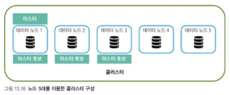

## 1. 클러스터 구성
### 1-1. 소규모 클러스터 구성 예시

- 마스터 후보 노드는 홀수로 지정해야 한다
- 데이터 노드는 많은 컴퓨터 리소스를 필요로 하기 때문에 가능한 많을수록 좋다

<br>

### 1-2. 대규모 클러스터  구성 예시

- 마스터 후보 노드들은 하드웨어 성능은 비교적 중요하지 않지만 최소 3대를 준비하고 가능한 한 클라이언트의 요청을 받지 않도록 구성한다
- 데이터 전용 노드는 온전히 데이터 작업만 진행하고 클러스터에서 가장 많이 배치해야 한다
- 데이터 전용 노드는 가능하면 고사양의 하드웨어를 구성하고 사양은 통일하는 것이 좋다
  - 분산 처리 시 복수의 노드에서 발생한 결과를 코디네이터 노드에서 취합해야 하는데 데이터 노드 하나의 응답이 느리면 전체 응답 속도에 영향을 미치기 떄문이다
- 데이터 읽기가 많은 시스템인지 데이터 쓰기가 많은 시스템인지 데이터가 얼마나 많이 필요한지에 따라 노드들을 다양하게 구성할 수 있다
- 다만 대규모 클러스터를 구성할 때 마스터 후보 전용 노드와 데이터 전용 노드를 나고, 마스터 노드는 클라이언트의 요청이나 데이터 작업에 참여하지 않고 클러스터 관리에 집중시키는 것이 좋다

<br>

### 1-3. 핫/웜/콜드 노드 구성
- 핫 노드
  - 활발하게 인덱싱과 검색이 일어나는 인덱스를 위치 시키고 충분한 리소스의 하드웨어 할당
- 웜 노드
  - 자주 사용하지 않는 데이터를 저장
  - 쿼리의 빈도가 낮고 인덱싱은 일어나지 않는 인덱스
  - 핫노드에 비해 성능 좋은 디스크나 큰 메모리는 필요 없지만 많은 데이터를 저장하기 위해 대용량 디스크를 사용
- 콜드 노드
  - 프리즈 모드의 인덱스를 저장
  - 프리즈 모드의 인덱스는 평상시에는 메모리에 띄워놓지 않으므로 인덱스를 유지하기 위한 메모리 공간이 필요하지는 않음
  - 검색 요청이 올 때 인덱스 파일을 오픈하기 때문에 검색 시간이 많이 소요
  - 하드웨어는 시스템 내에서 지원하는 최소한의 사양으로 구성하되 디스크의 용량만 필요한 만큼 갖추면 되고, 가용성을 위한 시스템 구성은 필요 없다

<br>
<br>

## 2. 클러스터 백업
- repository를 지정하고 snapshot을 찍고 복원할 수 있다
- snapshot은 클러스터 전체를 찍거나 특정 인덱스만 찍을 수 있다

<br>

### 2-1. repository 등록
- repository 등록 API
  ``` 
  PUT _snapshot/fsrepo
  {
    "type" : "fs",
    "settings" : {
      "location" : "C:\\elasticsearch-7.10.1"
    }
  }
  ```
  - 지원하는 타입
    - fs, hdfs, s3, azure, gcs
  - repository는 클러스터를 구성하는 마스터 노드와 데이터 노드가 동일한 위치를 공유해야 한다

<br>

### 2-2. snapshot 찍기
- snapshot을 찍을 때는 기존 데이터 대비 변경사항만 추가 반영되는 구조이기 때문에 가능하면 자주 찍는 방식을 권장
- snapshot 찍기 요청
  ``` 
  PUT _snapshot/fsrepo/snapshot1
  ```
  - fsrepo는 레퍼지토리 이름, snapshot1은 스냅샷 이름
  - `"accepted" : true` 결과를 받으면 성공한 것
- 특정 인덱스의 snapshot 찍기 요청
  ``` 
  PUT _snapshot/fsrepo/snapshot2
  {
    "indices" : "kibana_sample_data_*",
    "ignore_unavailable" : true
  }
  ```
  - indices 필드는 스냅샷을 찍을 인덱스들이다. 배열 형태로 여러 인덱스를 선택할 수 있고 와일드카드 형식으로 인덱스 패턴을 지정해 여러 인덱스를 선택할 수도 있다
  - 인덱스를 지정하지 않으면 클러스터 내의 모든 인덱스의 스냅샷을 찍는다
  - `"ignore_unavailable" : true` 옵션을 true로 지정하면 비활성화 상태의 인덱스는 스냅샷에 기록되지 않는다

<br>

### 2-3. snapshot 복원
- 모든 인덱스 복원 요청
  ``` 
  PUT _snapshot/fsrepo/snapshot1/_restore
  ```
  - 예를 들어, 현재 클러스터에 index1 인덱스가 있는데 레퍼지토리에 index1 인덱스가 있다면 복원이 되지 않는다. 이름이 겹치는 인덱스를 지우고 복원을 하던지 아니면 인덱스 이름을 변경해야 한다.
- 특정 인덱스만 복원
  ``` 
  PUT _snapshot/fsrepo/snapshot1/_restore
  {
    "indices" : "kibana_sample_daata_*",
    "ignore_unavaliable" : true,
    "rename_pattern" : "kibana_sample_data_(.+)",
    "rename_replacement" : "restored-kibana_sample_data_$1"
  }
  ```
  - rename_pattern은 변경하려는 인덱스 이름, rename_replacement는 변경되는 인덱스 이름

<br>
<br>

## 3. 샤드
- 엘라시틱서치는 여러 대의 노드를 효율적으로 활용하기 위해 데이터를 샤드 단위로 나눠 분산 저장한다
- 실제로 인덱스는 가상의 논리적 단위이며 실제 도큐먼트의 인덱싱과 검색은 샤드에서 일어난다
- 샤드 구성과 인덱싱 과정
  - 인덱스를 만들 때 샤드 개수를 정한다 
  - n개의 샤드는 노드에 적절히 분배된다
  - 도큐먼트가 인덱싱되면 도큐먼트는 n개의 샤드 중 하나의 샤드 내의 세그먼트로 저장된다
  - 코디네이터 노드(최초 요청을 수신한 노드)는 문서에 별도의 ID가 주어지지 않는다면 랜덤 ID를 생성하며, _routing 파라미터가 명시되지 않았다면 ID를 이용해 도큐먼트가 인덱싱될 샤드를 결정한다
- 샤드와 세그먼트 구조
  - 샤드는 하나의 루씬 인스턴스이며 여러 개의 세그먼트를 포함하고 있다
  - 세그먼트는 엘라스틱서치에서 인덱스가 물리적으로 저장되는 가장 작은 단위로 읽기에 최적화된 형태이며 수정은 불가능하다
  - 세그먼트는 자체적으로 루씬 검색이 가능한 구조이며 토큰화된 역인덱스 데이터와 소스 데이터가 들어 있다
  - 루씬에서 인덱스 검색을 요청하면 각각의 세그먼트들로부터 검색하고 이를 통합해 최종 결과가 나온다
  - 세그먼트는 리프레시될 때마다 생기는데 리프레시는 클러스터의 모든 샤드에서 기본적으로 1초마다 발생하며 리프레시가 되어야 새로 추가된 도큐먼트 검색이 가능하다
  - 너무 작은 세그먼트들이 만들어지면 읽기 성능이 저하되므로 이를 방지하기 위해 내부적으로 틈틈이 세그먼트들을 병합한다

<br>

### 3-1. 프라이머리 샤드와 레플리카 샤드
- 인덱스 설정에서 프라이머리 샤드와 레플리카 샤드 개수를 지정할 수 있다
  ``` 
  PUT index
  {
    "settings" : {
      "number_of_shards" : 3,
      "number_of_replicas" : 2
  }
  ```
  - number_of_shards는 프라이머리 샤드 개수, number_of_replicas는 레플리카 샤드 개수
  - 레플리카 샤드는 프라이머리 샤드 개수를 한 단위로 두 벌을 추가한다
    - 위 경우 프라이머리 샤드가 3개이고, 이 3개의 샤드가 각각 두 벌씩 복제되어 6개의 레플리카 새드가 만들어진다
- 샤드가 균형 있게 분산되어 있으면 좋은 샤드를 취사선택해 리소스 활용량을 최적화 할 수 있다.

<br>

### 3-2. 샤드 할당 과정
- UNASSIGNED(미할당)
  - 샤드는 있지만 아직 노드에 할당되지 않은 상태
- INITIALIZING(초기화)
  - STARTED 전 초기화를 위한 상태
  - 노드에 샤드가 추가된 상태이지만 아직 메모리에 온전하게 적재된 것은 아니라서 샤드를 사용할 수는 없다
  - 마스터 노드는 데이터 노드들 중에서 샤드를 생성할 수 있는 노드를 찾고 할당이 가능한 노드부터 프라이머리 샤드를 적재하기 시작한다
- STARTED(동작)
  - 샤드가 메모리에 올라간 상태로 이 상태에서만 접근이 가능
  - 프라이머리 새드가 STARTED 상태가 되면 레플리카 샤드가 할당된다
- RELOCATING(재할당)
  - 샤드가 재배치되는 단계
  - 분산 환경 시스템에서 노드들은 고장이나 네트워크 문제로 노드가 추가되거나 삭제되는데, 노드가 변경될 때마다 샤드 역시 재배치가 필요하다
  - 노드 수가 변하지 않더라도 저장공간이나 샤드 수 등을 기준으로 주기적인 리밸런싱이 일어날 때도 재배치 작업이 필요하다

### 3-3. 샤드 상태 모니터링
- 샤드 상태 확인
  ``` 
  GET _cat/shards?v
  ```
- 인덱스 상태 구분
  - red
    - 하나 이상의 프라이머리 시드가 클러스터에 정상적으로 적재되지 않았다. 데이터 읽기/쓰기가 정상적으로 동작하지 않는다
  - yellow
    - 프라이머리 샤드는 모두 적재되었지만 하나 이상의 래플리카 샤드가 정상적으로 적재되지 않았다. 인덱스를 읽고 쓰는 것은 문제없지만 레플리카 샤드가 없으면 장애 발생 시 해당 인덱스에 대한 서비스가 불가능할 수 있다
  - green
    - 프라이머리 새드와 레플리카 샤드가 모두 정상적으로 적재되었다

<br>
<br>

## 4. 샤드 개수와 구성
- 샤드가 늘어나면 더 많은 스레드를 활용해 인덱스를 병렬 검색
- 샤드가 적으면 요청을 분배하고 취합하기 위한 비용이 줄어든다

### 4-1. 샤드 개수
- 인덱스를 생성할 때 따로 설정을 하지 않을 경우 기본값으로 샤드가 생성된다
- 오버 샤딩은 샤드를 잘게 나누어 필요 이상의 많은 리소스를 사용하게 하는 문제다
  - 샤드는 개별적으로 리소스를 소비한다. CPU나 메모리는 물론이고 루씬 인스턴스의 리소스도 필요하다
  - 인덱스를 검색하기 위해서는 인덱스가 저장된 모든 샤드에 접근해야 한다
- 기본적으로 오버샤딩은 피하고 분산/병렬이 잘되는 샤드 개수를 찾아야 한다
  - 공식적으로 권장하는 방법은 실 데이터를 가지고 샤드 수를 조정하며 벤치마크 하는 것
  - 클러스터에서 제공하는 CPU 코어 개수에 따라 샤드 개수를 결정하기도 하지만, 적절한 샤드 수는 프로젝트 성격이나 시스템 구성에 따라 바뀐다

### 4-2. 샤드 크기
- 샤드가 너무 크면 성능 문제가 발생하고 샤드가 너무 작으면 담을 수 있는 도큐먼트가 작아진다
- 검색이 많은 시스템인지 저장이 중요한 시스템인지에 따라 샤드 크기는 변경될 수 있고 노드의 리소스 상태도 영향을 미친다
- 엘라스틱에서는 통계적으로 볼 때 샤드 하나의 크기가 10GB~40GB 정도로 관리하는 것이 좋다고 권고한다
- rollover API
  - rollover API는 인덱스가 특정 조건에 도달했을 때 새로운 인덱스를 생성하는 API
  - 요청이 있을 경우만 발생하기 때문에 요청 전까지는 샤드 크기가 아무리 커져도 새로운 인덱스가 생성되지 않는다. 시스템이 자동으로 조건을 체크하고 조건에 맞는 경우 새로운 인덱스를 생성하는 기능은 ILM이 제공하낟.
- shrink API
  - shrink API는 기존 인덱스의 프라이머리 샤드 개수를 줄이는 데 사용한다
  - 처음 인덱스를 생성할 때 프라이머리 샤드를 너무 많이 만들었다면 shrink API로 샤드를 병합해 샤드 수를 줄일 수 있다
  - 자주 사용하지 않아 핫 노드에서 웜 노드로 이동하는 인덱스에서도 사용 가능
  - 자주 사용하지 않는 기존 인덱스를 롤오버하며 shrink API로 샤드 개수를 줄이기도 한다

<br>
<br>

## 5. 설정
운영이나 개발 과정에서 발생하는 시스템의 크고 작은 설정값들을 변수화하여 상황에 맞게 사용

|설정|설명|
|---|---|
|클러스터 설정|로그 레벨이나 클러스터 전반에 관한 설정을 한다. REST API를 이용해 동적으로 설정값을 변경할 수 있다.|
|노드 설정|네트워크 인터페이스, 보안 설정 등 같은 노드 구성에 관한 설정을 한다. elasticsearch.yml 파일에서 정적으로 수정한다.|
|인덱스 설정|인덱스와 관련된 설정을 할 수 있다. 프라이머리 샤드나 레플리카 개수 설정 등을 할 수 있으며 정적/동적으로 설정이 가능하다. 제공하는 REST API를 이용해 동적으로 인덱스별 설정값을 변경할 수 있다.|

<br>

### 5-1. 클러스터 설정
- 클러스터 설정 확인 요청
  ``` 
  GET _cluster/settings
  GET _cluster/settings?include_defaults=true
  ```
- 클러스터 설정
  - logger.*
  - cluster.routing.allocation.*
  - cluster.blocks.read_only

<br>

### 5-2. 노드 설정
- 노드 설정 확인 요청
  ``` 
  GET _nodes/settings
  ```
- 노드 설정
  - node.roles
  - path.data
  
<br>

### 5-3. 인덱스 설정
- 인덱스 설정 확인 요청
  ``` 
  GET index/settings
  ```
- 인덱스 설정
  - index.number_of_shards
  - index.number_of_replica
  - index.refresh_interval
  - index.blocks.read_only